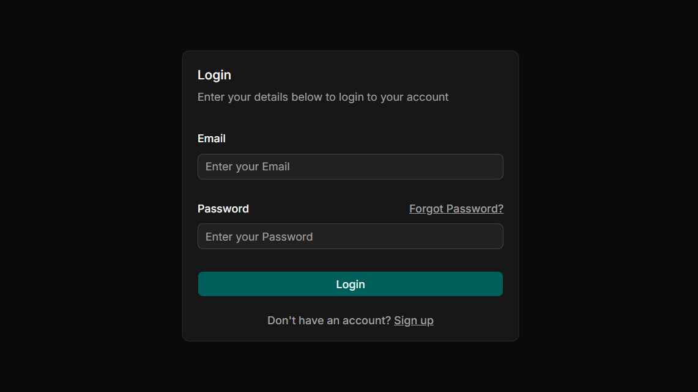

# roam-auth

Building authentication from scratch, the right way.

A JWT-based authentication system built with Go, React, and PostgreSQL - short-lived JWTs for stateless request verification, refresh tokens for server-side session control, and HttpOnly cookies to keep tokens safe from XSS.

Full post: [How I Built Authentication in Go and React: Doing It Right](https://www.prajwalpatil.com/writings/building-auth)

## Stack

- **Server:** Go (`net/http`), `golang-jwt`, `bcrypt`, `jackc/pgx`
- **Database:** PostgreSQL, with migrations via `goose` and queries via `sqlc`
- **Client:** React + Vite, `react-hook-form` + `zod`, `axios`, `react-router` (Data mode)

## How to run?

### Set credentials

```sh
cp .env.example .env

vi .env
```

Update it with your PostgreSQL connection details and secrets.

### Perform migrations

You may need to install `goose` if it isn't already installed.

```sh
goose up
```

### Go Server

```sh
go run main.go
```

### Vite - React Client

```sh
cd ./app/roam-auth

pnpm install

pnpm run dev
```
